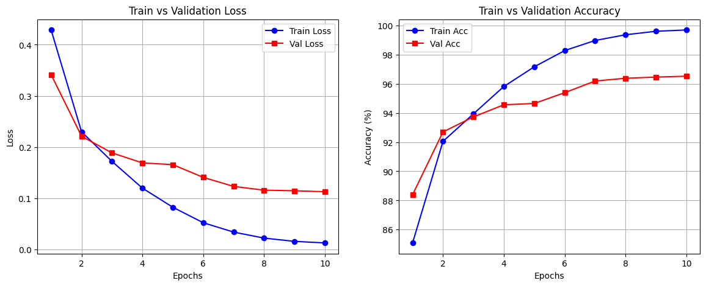
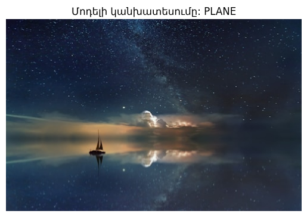

# CIFAR-10 Image Classification using ResNet18 (Fine-Tuning)

Այս նախագծում իրականացվել է նախապես մարզված (Pre-trained) ResNet18 մոդելի fine-tuning՝ CIFAR-10 տվյալների բազայի (dataset) համար՝ օգտագործելով PyTorch framework-ը։

## 🚀 Արդյունքներ (Metrics & Benchmarks)
Մոդելը մարզվել է 10 էպոխ (Epochs) T4 GPU-ի վրա և գրանցել է հետևյալ բարձր արդյունքները.
* **Training Accuracy:** 99.69%
* **Validation Accuracy:** 96.52%
* **Validation Loss:** 0.1126

## 🛠️ Օգտագործված Տեխնոլոգիաներ և Հիպերպարամետրեր
* **Ճարտարապետություն:** ResNet18 (ImageNet Weights)
* **Optimizer:** SGD (Learning Rate: 0.01, Momentum: 0.9, Weight Decay: 5e-4)
* **Scheduler:** CosineAnnealingLR
* **Data Augmentation:** Resize(224x224), RandomHorizontalFlip, RandomRotation(15)

## 📊 Մարզման Գրաֆիկներ

## 🔍 Inference-ի Օրինակ

